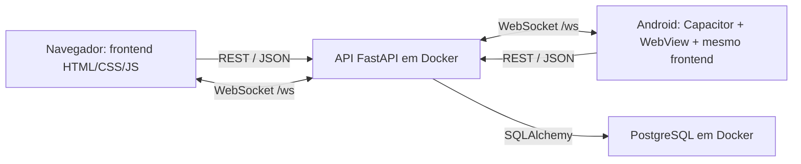

# DataPlate Mobile

O aplicativo Android reaproveita o mesmo frontend e a mesma API FastAPI da versao web. O projeto nativo fica em `android/` e usa Capacitor.

## Arquitetura implementada

A arquitetura geral e cliente-servidor, com tres camadas: apresentacao, API e persistencia. No celular, a apresentacao usa um aplicativo hibrido: o Capacitor empacota os arquivos web e os executa em uma WebView Android.



| Parte | Implementacao no projeto | Responsabilidade |
| --- | --- | --- |
| Interface | HTML, CSS e JavaScript em `frontend/` | Login, administracao, atendimento, cozinha, PDV e cardapio |
| Container Android | Capacitor 8.5.2 e `MainActivity` estendendo `BridgeActivity` | Executar o frontend empacotado em uma WebView |
| Adaptacao mobile | `frontend/Css/mobile.css` e `frontend/JavaScript/mobile-runtime.js` | Layout para toque, area segura da tela, navegacao e configuracao do servidor |
| API | FastAPI, routers, schemas Pydantic e models SQLAlchemy | Atender requisicoes, validar dados e acessar o banco |
| Persistencia central | PostgreSQL 16 | Compartilhar dados operacionais entre os clientes |
| Comunicacao | REST com JSON e WebSocket em `/ws` | Requisicoes e atualizacoes em tempo real |
| Autenticacao | JWT e senhas com bcrypt no backend | Autenticar usuarios; a sessao do cliente fica em `sessionStorage` |
| Compilacao Android | JDK 21, Android SDK e Gradle Wrapper | Gerar o APK de teste |
| Recursos PWA | Manifest e service worker | Instalacao web e cache inicial de parte da interface |

A API e um monolito modular organizado em routers, schemas e models. O mobile empacota a pasta `frontend`, definida em `webDir` no `capacitor.config.ts`. As dependencias React/Vite presentes na raiz nao fazem parte da interface empacotada por essa configuracao.

O HTML, CSS e JavaScript sao copiados para o APK durante `cap sync android`. A API e o banco continuam no servidor; o aplicativo acessa a API por rede, e o servidor acessa o PostgreSQL.

## Premissas desta implementacao

1. Reaproveitar o frontend existente permite manter a mesma interface e integracao com a API nas versoes web e Android.
2. A demonstracao usa um computador executando Docker e um celular conectado a uma rede que alcance esse computador, normalmente o mesmo Wi-Fi.
3. O endereco da API e configuravel pelo botao `Servidor` e fica salvo em `localStorage`. No emulador, o endereco inicial e `10.0.2.2`; no celular fisico, deve ser informado o IPv4 do computador.
4. A aplicacao precisa de conexao com a API para login e operacoes de negocio. O cache PWA cobre parte da interface inicial; nao ha fila de pedidos offline nem banco operacional no celular.
5. Os dados compartilhados ficam no PostgreSQL. `localStorage` tambem guarda estado de interface e algumas preferencias; isso nao substitui a persistencia central nem sincroniza essas preferencias entre aparelhos.
6. As telas devem funcionar com toque e pouco espaco. Ha navegacao inferior na administracao, abas de produtos/pedido no PDV e tratamento de areas seguras da tela.
7. O ambiente de demonstracao usa HTTP na rede local, com trafego liberado no Android e origens explicitas no CORS da API. Uma distribuicao para producao exigiria configurar HTTPS e gerar uma versao de release assinada.
8. A plataforma implementada neste repositorio e Android, com `minSdkVersion` 24. O projeto nao contem um aplicativo iOS gerado.
9. As bibliotecas de graficos e PDF do painel administrativo sao carregadas de CDN. Esses recursos dependem de acesso a internet para carregar as bibliotecas, mesmo quando a API esta na rede local.

Essas premissas descrevem o comportamento observado no codigo atual e as condicoes para executa-lo.

## Explicação

> Implementei a versao Android reaproveitando o frontend HTML, CSS e JavaScript do DataPlate. Usei Capacitor para empacotar esse frontend em uma WebView e gerar o APK pelo Gradle. A arquitetura e cliente-servidor em tres camadas: o app apresenta as telas, a API FastAPI processa as requisicoes e o PostgreSQL armazena os dados. O app se comunica por REST com JSON e recebe atualizacoes por WebSocket. Adaptei os layouts para toque, acrescentei navegacao mobile e uma tela para configurar o endereco da API. Para a demonstracao, assumi que o computador e o celular conseguem se comunicar pela mesma rede e que a API esta disponivel.

Para mostrar a implementacao, abra `capacitor.config.ts`, `android/app/src/main/java/br/com/dataplate/app/MainActivity.java`, `frontend/JavaScript/mobile-runtime.js`, `frontend/Css/mobile.css` e `backend-python/app/main.py`.

Referencia: [documentacao oficial do Capacitor](https://capacitorjs.com/docs) e [configuracao do Capacitor](https://capacitorjs.com/docs/config).

## Dados de demonstracao

Com o PostgreSQL Docker e a API rodando, execute na raiz do projeto:

```powershell
node scripts/seed-manager-demo.mjs
```

O script acrescenta 16 pedidos do dia em diferentes status, historico dos sete dias anteriores, seis mesas de demonstracao e tres insumos com estoque baixo, zerado e normal. Os dados existentes sao preservados. Repetir o comando no mesmo dia nao duplica os registros nem desfaz alteracoes feitas durante os testes.

Atualize o painel do gerente para visualizar os indicadores e clicar nos cards.

## Executar na apresentacao

1. Conecte o computador e o celular na mesma rede Wi-Fi.
2. Inicie o sistema normalmente:

```powershell
.\dev-start-python.ps1
```

3. Descubra o IPv4 do computador:

```powershell
ipconfig
```

4. Abra o DataPlate no celular, toque em `Servidor` e informe apenas o IPv4, por exemplo `192.168.0.10`. O app completa a porta `8081` e o caminho `/api` automaticamente.
5. Use `Testar conexao`. Quando o teste ficar verde, toque em `Salvar e conectar`.

No emulador do Android Studio, use `10.0.2.2` como servidor.

O administrador de desenvolvimento criado pela API usa CPF `000.000.001-91` e senha `admin123`, salvo se as variaveis `DEFAULT_ADMIN_*` forem alteradas ou a conta existente tiver outra senha. Os demais usuarios podem ser cadastrados pelo painel.

## Gerar o APK

Para sincronizar o frontend e compilar o APK de teste:

```powershell
npm run mobile:build
```

O arquivo gerado fica em:

```text
android/app/build/outputs/apk/debug/app-debug.apk
```

Para abrir o projeto no Android Studio:

```powershell
npm run mobile:open
```

Sempre que HTML, CSS ou JavaScript mudar, execute `npm run mobile:sync` antes de compilar ou executar pelo Android Studio.

## Icone e splash

As imagens-fonte ficam em `resources/`. Para recriar todas as densidades do Android depois de alterar a marca:

```powershell
npm run mobile:assets
```

## Validacao responsiva

Com o frontend rodando na porta 5500:

```powershell
npm run test:mobile
```

O teste abre o site, login, recuperacao de senha, configuracao do servidor, cardapio, administracao, atendimento, cozinha e as duas abas do PDV em `360x800` e `412x915`.

## Validacao em 05/10/2026

Depois de integrar a `main` em `5f827fd`, a API foi ajustada para usar `settings.cors_origins`, incluindo as origens do Capacitor ja configuradas no ambiente.

- API, PostgreSQL e Adminer iniciados; migracoes encerradas com codigo zero.
- Health checks da API e do banco respondendo; login com o administrador real aprovado.
- Leitura das rotas de usuarios, categorias, produtos, mesas, pedidos, clientes, insumos e restaurante aprovada.
- Preflight CORS e leitura do health check aprovados para as origens web e mobile configuradas; origem nao configurada rejeitada.
- Login pela interface, abertura dos cinco modulos operacionais, configuracao do servidor mobile e conexao WebSocket aprovados em Chromium: 33 verificacoes de execucao.
- Teste responsivo aprovado em 24 combinacoes de tela e tamanho de viewport.
- Os 15 cards do gerente foram validados com filtros, paginacao, detalhes e teclado em 320, 390, 768, 1024 e 1440 px.
- Login e cards com o banco Docker real aprovados em 390 e 1440 px; 44 combinacoes de data, status e paginacao da API aprovadas.
- Dados de demonstracao adicionados sem apagar registros anteriores; repeticao do seed no mesmo dia nao duplicou dados.
- `npm run mobile:build` concluido e APK de debug atualizado.
- APK instalado e executado no emulador `Medium_Phone_API_36.1`: abertura da WebView Capacitor real, conexao com a API por `10.0.2.2`, persistencia do servidor, login real, abertura dos cinco modulos com dados e WebSocket aprovados em 10 verificacoes Android.

As verificacoes no Chromium incluem simulacao do modo Capacitor. O teste adicional executou o APK real no emulador Android e acessou sua WebView via Playwright/ADB. Um celular fisico nao foi testado. As verificacoes de execucao cobrem login e leituras; o ciclo completo de criar, preparar, entregar e pagar pedidos ainda requer validacao especifica.

O codigo mobile, os recursos Android e a documentacao sao versionados junto com o frontend. O APK de debug e os arquivos locais do Android SDK ficam fora do Git; cada integrante gera o APK com `npm run mobile:build`.
